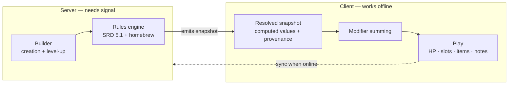

# Roadmap & Design Handoff

**Status:** design agreed, nothing built. Last updated 2026-07-27.
**Audience:** Ghopper, and any AI agent picking up work on this project.

This document is the shared source of truth for *where this project is going and
why*. Read it before proposing architecture, and before undoing anything in the
**Settled decisions** table — those were argued out and chosen deliberately. If
you think one is wrong, say so explicitly rather than quietly designing around it.

Longer-form session context lives outside the repo at
`/workspace/Claude Notes/Claude Memory/project_dnd_elliot_sheet.md`.

---

## 1. Where the project is today

A **static, dependency-free D&D 5e character sheet**. No build step, no
framework, no backend.

| | |
|---|---|
| Files | `index.html`, `style.css`, `app.js`, `icons/`, `assets/` |
| State | One flat JS object, serialised whole to `localStorage` under `elliot-sheet-v1` |
| Hosting | GitHub Pages from `main` — https://ghopper-dev.github.io/dnd-elliot-sheet/ |
| Repo | `github.com/ghopper-dev/dnd-elliot-sheet` |
| Design | Figma file `3ptITqEuKE3yvlZbfSwuB5`, node `1:27` ("Desktop View") |

It works, it's live, and it is used at a real table. **Nothing in this roadmap
justifies breaking the current sheet before its replacement is ready.**

---

## 2. What it's becoming

A **player's companion** — one place for everything a D&D player accumulates:
their character, session notes, inventory, and a campaign log of the NPCs,
places and quests they've run into. Plus session recaps generated from
recordings.

It grows a rules-aware character builder eventually. **The builder is a feature,
not the product.** The daily value is "everything in one place," and any design
that makes the builder the centre of gravity has misread the brief.

Scope is all of D&D, not one character or one subclass.

**Guiding principles**

1. **The phone is the primary device.** Play happens one-handed, at a table,
   possibly with no signal. Desktop is the roomy version, not the default.
2. **Offline is a design principle, not a feature.** If it doesn't work in
   aeroplane mode, it doesn't work at game night.
3. **Free to run, free to use.** No monetisation. Costs must stay near zero at
   the scale of a few tables.
4. **Self-hostable.** Anything that can't run in `docker compose up` is out.

---

## 3. Roadmap

### v1 — Sync + accounts (no builder)

The current sheet, made multi-user and multi-device. Users type their own stats.

- Port UI to components, **mobile-first**
- Real accounts, `owner_id` on every row from the first migration
- Local-first sync: local cache is the source of truth, network is write-through
- Offline queue; `rev`-based optimistic concurrency for conflicts
- One-time import of the existing `elliot-sheet-v1` localStorage blob
- Sanitise note bodies (see §6)

**Done when:** Ghopper edits on a phone at the table with no signal, and it's on
the laptop when he gets home.

### v2 — Session recaps

Turn a session recording into structured campaign history.

- Accept a transcript (paste or file upload)
- One server route → LLM → recap written to the session note, plus extracted
  NPCs / places / quests / loot written to the campaign log
- Campaign log entities (`npc`, `place`, `quest`, `loot`), linkable from notes

**Critical context:** this is *not* a transcription pipeline. Ghopper already
records sessions on his iPhone and gets a transcript back free, on-device, then
runs it through AI by hand. v2 automates that copy-paste. **No Whisper, no GPU,
no job queue, no object storage, no audio retention, no per-minute billing.**
Cost is pennies per session because the LLM operates on text, not audio-seconds.

Self-hosted WhisperX remains the upgrade path if speaker labels ever matter
(phone transcripts have none). Nothing in v2's design blocks it.

**Done when:** a transcript goes in and next week's "what happened last time?"
is answered without anyone rereading 40,000 words.

### v3 — Rules-aware character builder

The big one. Months, not weeks.

- SRD 5.1 (2014 rules) seed data
- Guided creation: species/class/subclass/abilities → computed sheet
- Named-modifier engine (see §4)
- Homebrew via JSON import against the same content schema as the seed
- Campaign-scoped content sharing (`campaigns`, `campaign_members`, DM role)

**Done when:** someone who isn't Ghopper builds a character without a rulebook.

---

## 4. Settled decisions

Do not relitigate these silently.

| Decision | Rationale |
|---|---|
| **TypeScript monolith (SvelteKit) + Postgres** | One container + a database, identical on the hosted instance and a self-hoster's compose file. Lets the modifier engine be one TS module imported by both server and client. |
| **Not Supabase / not Cloudflare Workers** | Both are vendor-shaped in the critical path. Self-hosting Supabase is ~10 containers; Workers have no self-hosted runtime at all. |
| **Storage behind an interface; all config via env vars** | Same code, different backends. This is what makes self-hosting real rather than theoretical. |
| **Client-side play, server-side build** | Play must work offline. The builder can afford to want signal — it runs once per character, not every session. |
| **Boundary is narrow: server owns creation + level-up only** | Equipping items, attaching modifiers, preparing spells, HP, slots and notes all stay client-side and offline. |
| **The builder emits a *resolved snapshot*, never raw choices** | If the server stores `{class: ranger, level: 9}` and the client derives from it, rules logic exists in two places and *will* drift. Store computed values plus provenance. |
| **Named modifiers, summed — not typed-over overrides** | `{source: "Cloak of Shadows", grants: [{skill: "Stealth", bonus: 2}]}`. Overrides rot: six months in nobody remembers why Stealth says 9. Modifiers also make homebrew and non-SRD content expressible as data. |
| **2014 5e, SRD 5.1** | Matches the actual table. Elliot is a Drakewarden with Elven Accuracy — neither exists in the 2024 rules. |
| **`owner_id` on every row from the first migration** | Even while single-user. Retrofitting ownership means a migration, a backfill and guesswork. This is the difference between a week's work to open signups and a data-layer rewrite. |
| **Notes are their own table, not part of the character blob** | In v2 the *server* writes recaps into notes. Inside the blob, that means read-modify-writing the whole character while the client edits HP — a race. Separate table, separate writer. |
| **Everything else stays one `data jsonb` column** | Mirrors the current `state` object exactly, so the migration is a straight lift. Nothing queries subsets of it. Normalise later if a real query appears. |
| **Port the vanilla UI to components in v1** | At 384 lines, not at 5,000. The imperative `render()` / `renderItems()` / `renderNotes()` pattern cannot carry derived values plus sync. |
| **Mobile-first sheet, desktop-first builder** | `style.css:783` already admits it: *"The Figma frame is desktop-only; these are the fallbacks."* Reworking layout during a port you're already doing is nearly free. |
| **Open source + Docker self-hostable, AND one hosted instance** | Self-hosting doesn't replace hosting — most players won't run compose. Both, not either. |
| **Free; open signups; no monetisation** | Costs stay flat because the only per-user cost (LLM recap) is pennies on text. |

### The build/play boundary



---

## 5. Data model sketch (v1)

Indicative, not final — but `owner_id` and `rev` are not optional.

```
users            -- from the auth library

characters
  id             uuid pk
  owner_id       uuid not null          -- from day one, even single-user
  name           text not null
  data           jsonb not null         -- the current `state` object, lifted whole
  schema_version int  not null
  rev            int  not null          -- optimistic concurrency
  created_at, updated_at

notes
  id             uuid pk
  owner_id       uuid not null
  character_id   uuid null              -- nullable so notes can be re-pointed
                                        -- at a campaign later, no migration
  title          text
  body           text                   -- sanitised HTML, see §6
  created_at, updated_at
```

**Sync contract.** Client writes locally first and always. Push is debounced
(~1.5s, not the current 400ms — that's a network round-trip per keystroke).
Update is conditional on `rev`; zero rows affected means someone else wrote
first, so refetch and tell the user rather than clobbering.

Campaign tables (`campaigns`, `campaign_members`) arrive with v3 and are purely
additive given `owner_id` already exists.

---

## 6. Known traps

Things that have already cost time here, or will.

- **⚠ Note bodies are stored and rendered as raw markup.** `app.js` (~line 338,
  `renderNotes`) assigns the saved note body straight into the DOM as HTML, with
  a deliberate comment justifying it: *"this is the user's own content in their
  own browser."* The rest of the file scrupulously uses `textContent` for exactly
  this reason. **Campaign sharing invalidates that justification** — it becomes
  stored XSS between users. Sanitise (DOMPurify or equivalent) in v1, before
  sharing exists to exploit it. The toolbar's `document.execCommand` calls are
  deprecated and want replacing at the same time.

- **⚠ Always run `file` on an image asset before trusting its extension.** Two
  icons here were JPEG data carrying `.png` names. JPEG has no alpha channel, so
  every icon rendered as an opaque rectangle and the pixel art's hard edges were
  destroyed by DCT compression. Browsers go by magic bytes, not filenames. This
  was the root cause of a whole "the UI looks off" investigation.

- **⚠ `border-image` needs art cropped tight to its bounding box.**
  `border-image-slice` measures inward from the *file's* edges, so a small
  drawing on a large transparent canvas slices empty space and renders nothing.
  The border box must also be thick enough for the art to scale into — 7px
  rendered hairline, 11px reads correctly (`--tab-edge`).

- **Don't reintroduce a CSS override layer.** `style.css` was once two
  stylesheets stacked, the second overriding ~40 properties of the first. That's
  why small edits had unpredictable results. It's one token layer in `:root` now
  — change values there, not inline.

- **Verify SRD dataset licences and coverage before depending on one.** The
  mature open datasets grew up around SRD 5.1, which is what v3 targets, but
  confirm scope rather than assuming.

- **Cost figures in this document are estimates.** Re-check current pricing
  before making a decision that depends on them.

---

## 7. Content and licensing policy

- The repo ships **SRD 5.1 seed data only**, with its CC-BY-4.0 attribution.
  Nothing else.
- **Non-SRD content is user data.** Drakewarden, Elven Accuracy and anything else
  from a published supplement is imported by each table onto their own instance.
  The project never distributes it. Self-hosting makes this clean.
- **Store mechanics as structured modifier data; never bundle book prose.** Game
  mechanics and expression are treated very differently in copyright, and the
  rules engine only needs the mechanics. Prose fields stay empty unless a user
  types their own.
- Unofficial wikis that host the full published catalogue do so without a
  licence. That is tolerance, not permission — not a model to copy.
- SRD 5.1's CC-BY-4.0 permits commercial use with attribution, so nothing here
  legally blocks donations or a paid tier. That's a choice, not a constraint.

*Not legal advice — this is the shape of the policy, not a legal opinion.*

---

## 8. Open decisions (blocked on Ghopper)

- [ ] **Code licence** — AGPL-3.0 (stops closed commercial forks; conventional
      for this kind of project) vs MIT. Decide before the first public commit.
- [ ] **Lato is loaded from Google Fonts** — one network request; degrades to a
      system sans offline. Now that offline is a design principle rather than a
      preference, self-hosting the font is ~10 minutes. Raised twice, undecided.
- [ ] **A mobile frame in Figma** alongside node `1:27`, to design the sheet
      against rather than reflowing the desktop composition.
- [ ] **Consent from the table** before v2 ships. WA's surveillance-devices law
      is consent-based, and it's their voices either way.
- [ ] README drift — it still describes Session Notes as collapsible; the real
      UI is a sidebar list plus an editor pane.

---

## 9. Working agreements

- **Merge via PR.** Branch, push, open a PR, merge. Don't commit to `main`.
- `gh auth status` reports the stored token as invalid, but `gh api` works if you
  pull the token from git's credential helper first:

  ```bash
  TOKEN=$(printf "protocol=https\nhost=github.com\n\n" | git credential fill | grep '^password=' | cut -d= -f2-)
  export GH_TOKEN="$TOKEN"
  gh api repos/ghopper-dev/dnd-elliot-sheet/pulls -X POST -f title=… -f head=… -f base=main
  ```

- Plain `git push` works normally. After merging, Pages takes ~30s.
- **Verify visually.** Layout bugs here have twice been invisible from the CSS
  alone. A headless-Chromium setup exists — see
  `/workspace/Claude Notes/Claude Memory/reference_headless_chromium_no_sudo.md`.
- **Don't break the live sheet.** It's in use at a real table.
